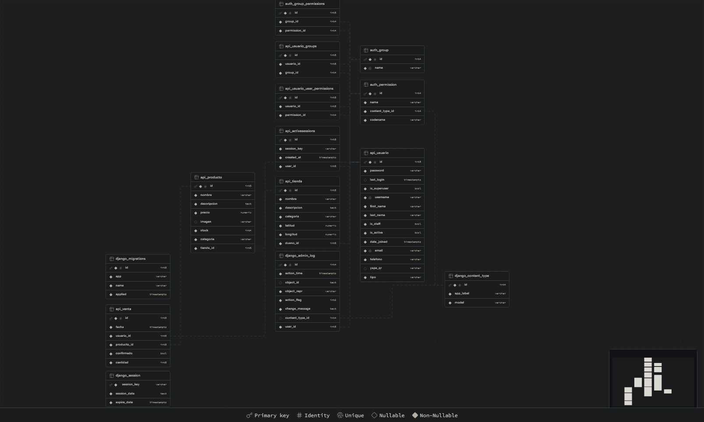

# KiosKios

KiosKios es una aplicación web diseñada para modernizar la compra y venta de productos en los kioscos de la Universidad Nacional de San Agustín. Esta plataforma utiliza una arquitectura moderna que separa el backend (Django y Django Rest Framework) del frontend (Angular), desplegada en la nube mediante Vercel y con almacenamiento de datos en Supabase.

## Estado del Proyecto

🚧 **Beta** 🚧

KiosKios se encuentra actualmente en versión beta. Estamos trabajando continuamente para mejorar y expandir sus funcionalidades.

## Características Principales

-   Autenticación de usuarios (incluyendo integración con Google)
-   Gestión de kioscos virtuales
-   Catálogo de productos con categorías
-   Sistema de ventas
-   Diferentes roles de usuario (comprador, dueño de kiosco, administrador)

## Tecnologías Utilizadas

-   Backend: Django y Django Rest Framework
-   Frontend: Angular
-   Base de Datos: Supabase (PostgreSQL)
-   Despliegue: Vercel (Funciones Serverless)

## Requisitos

-   Python 3.12
-   Node.js (para Angular)

## Instalación y Configuración

1. Clonar la rama `localhost` del repositorio:

    ```
    git clone -b localhost https://github.com/cmestasz/KiosKios.git
    ```

2. Instalar las dependencias del backend:

    ```
    cd kioskios_api
    pip install -r requirements.txt
    ```

3. Instalar las dependencias del frontend:

    ```
    cd ../kioskios_frontend
    npm install
    ```

4. Ejecutar el servidor backend:

    ```
    python manage.py runserver
    ```

5. En otra terminal, ejecutar el servidor frontend:
    ```
    ng serve
    ```

## Modelado de la Base de Datos

A continuación se presenta el esquema relacional, generado por Supabase:

 </img>

## Demo en Vivo

Puedes ver una demostración en vivo de KiosKios en: [https://kios-kios.vercel.app/](https://kios-kios.vercel.app/)

## Videos de Revision

A continuación se presentan todos los videos para su revisión:

### Video Completo

[Video Completo](https://drive.google.com/file/d/1qV4IwAOiUE54LSrSHNQBFwcDeUjsEVNE/view?usp=drive_link)

### Video Corto

[Video Corto](https://drive.google.com/file/d/1j8xwLwQyjmiSUkdJtNDlAnKcg7fFtwz9/view?usp=drive_link)

### Videos por Secciones

#### Django y DRF

[Video Sobre Django y DRF](https://drive.google.com/file/d/1dFDd_v5g0HYl1hf3-SDEFLHkJTy1XADm/view?usp=drive_link)

#### Forms de Angular

[Video Sobre Forms de Angular](https://drive.google.com/file/d/1rjBoBn7CnvTSGFF3tZhK28jPuJ1NaVNS/view?usp=drive_link)

#### Estilo de Angular

[Video Sobre Estilo de Angular](https://drive.google.com/file/d/1yydrDxfJIFMQTgrGjyxwPrydC2tYnThq/view?usp=drive_link)

#### Autenticación en Angular

[Video Sobre Autenticación en Angular](https://drive.google.com/file/d/1dLZcY9lnDOQXDFcNRsJCX8kBiaYjF_7m/view?usp=drive_link)

#### Presentación de la Página

[Video Sobre Presentación de la Página](https://drive.google.com/file/d/1R7NdZlrbFuKQ9hOU323gDa2tkdqM3CCu/view?usp=drive_link)

#### Despliegue en Vercel y Supabase

[Video Sobre Despliegue en Vercel y Supabase](https://drive.google.com/file/d/1yaz_W7Ov0U2b6fZq5aF86WddZQrhpkwK/view?usp=drive_link)

## Documentos Requeridos

A continuación se presentan los documentos para la presentación:

### Artículo

[Artículo](https://drive.google.com/file/d/1R7ZMPdwbSVaoxalynU-cbzec-4F-uutG/view?usp=drive_link)

### Diapositivas Usadas en los Videos

[Diapositivas](https://drive.google.com/file/d/1svSf6Tam5Kf-T8xuGPWDNj3ggVAs-7Wa/view?usp=drive_link)

### Póster de Presentación

[Poster](https://drive.google.com/file/d/1yBOQ2H46R3OXRzYbjb8l3GgzkFH3MmH1/view?usp=drive_link)

## Autores

-   Dolly Yadhira Mollo Chuquicaña
-   Christian Raul Mestas Zegarra
-   Luis Gustavo Sequeiros Condori

## Licencia

Este proyecto es software propietario y su uso está restringido. Todos los derechos reservados.
